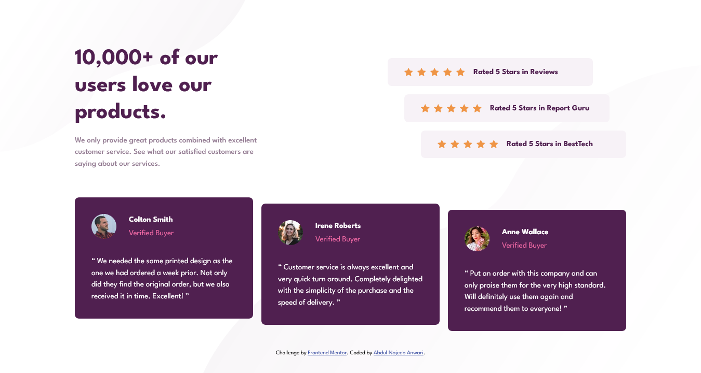

# Frontend Mentor - Social proof section solution

This is a solution to the [Social proof section challenge on Frontend Mentor](https://www.frontendmentor.io/challenges/social-proof-section-6e0qTv_bA). Frontend Mentor challenges help you improve your coding skills by building realistic projects. 

## Table of contents

- [Overview](#overview)
  - [The challenge](#the-challenge)
  - [Screenshot](#screenshot)
  - [Links](#links)
- [My process](#my-process)
  - [Built with](#built-with)
  - [Continued development](#continued-development)
  - [Useful resources](#useful-resources)
- [Author](#author)

## Overview

### The challenge

Users should be able to:

- View the optimal layout for the section depending on their device's screen size

### Screenshot

### Links

- Solution URL: [Solution URL](https://github.com/najeeb-anwari/social-proof-section)
- Live Site URL: [Live View](https://your-live-site-url.com)

## My process

### Built with

- Semantic HTML5 markup
- CSS custom properties
- Flexbox
- CSS Grid
- Mobile-first workflow

### Continued development

I am still not comfortable with CSS Grid , but still want do more practices to master the skill.

### Useful resources

- [CSS Diner](https://flukeout.github.io/) - I'd recommend it to anyone because it is an interactive game to practice CSS Selectors.
- [Flexbox Froggy](https://flexboxfroggy.com/) - This is an amazing website which helped me review my flexbox skills. I'd recommend it to anyone because it is an interactive game to practice flexbox.
- [Grid Garden](https://cssgridgarden.com/) - This is an amazing website which helped me review my Grid skills. I'd recommend it to anyone because it is an interactive game to practice Grid.

## Author

- Frontend Mentor - [@najeeb-anwari](https://www.frontendmentor.io/profile/najeeb-anwari)
- Github - [@najeeb-anwari](https://github.com/najeeb-anwari)
- Twitter - [@yourusername](https://www.twitter.com/najeeb_anwari)
